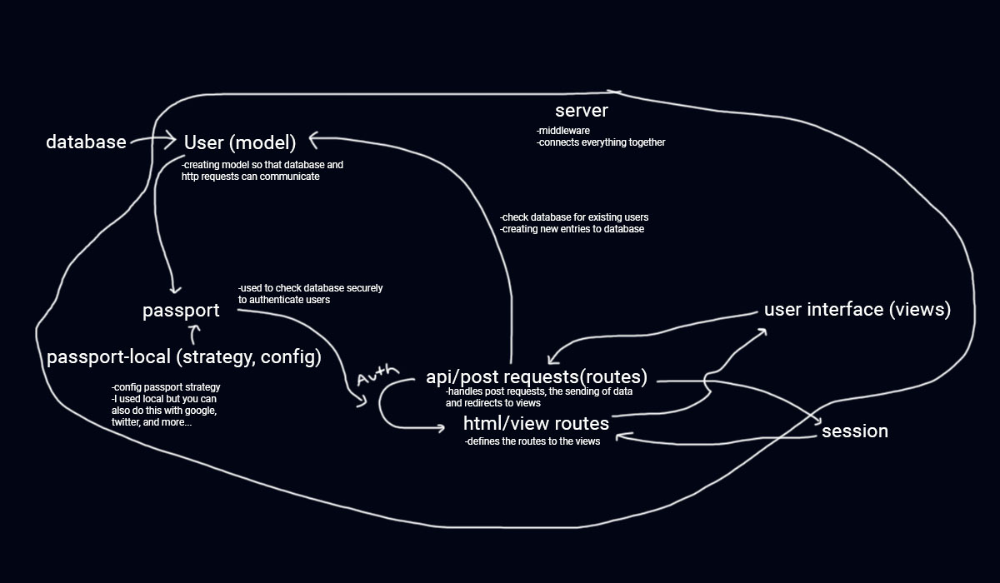

## Simple Authentication with MySQL and passport-local
Learning about authentication... After pulling my teeth out for a couple of days, I finally was able to create a simple authentication with signup and login.

### Technologies
 - express
 - nodejs
 - mysql
 - passport-local
 - sequelize

### Questions that I had while building this:

 1) What does `express-session` do?
 - `express-session` handles the session data. For this project, that is really all you need to know. Everything that is done with the session data is done under the hood. Packages like `passport-local` and `connect-flash` also manipulate the session data.
 2) What is the purpose of serialize and deserialize?
 - Serialize and deserialize are used by passport to get the user data to and from the session data.
 3) Why do we config a `passport strategy` and then pass `passport` in this function?
 - `Passport strategy` setups of the username and password validation settings and how it will be handled. You can use it to send custom messages with `connect-flash`. 
 4) What does `next` do?
 - `next` allows for another middleware to be called in an `app.<request>`. For example:

 ```
 router.get('/members', isAuth ,(req, res) => {
    res.sendFile(path.join(__dirname, '../public/members.html'));
})
```

`isAuth` returns next() which allows for the final callback/parameter in `router.get` to run.

 5) Draw a picture of structure.


